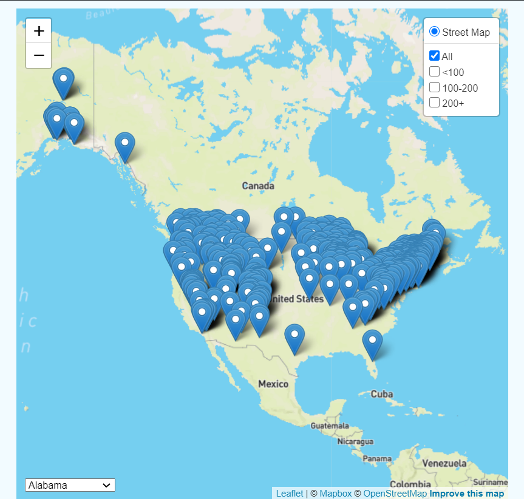
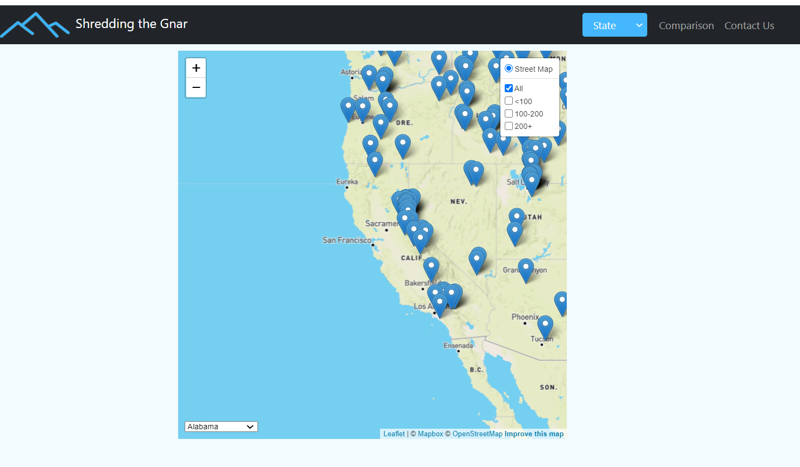
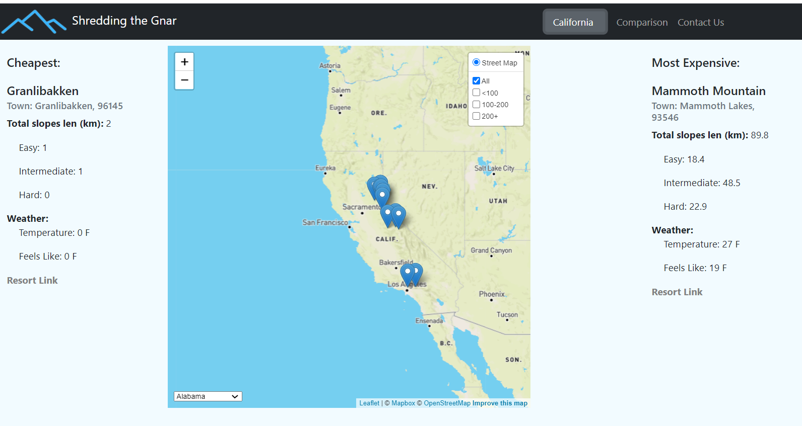
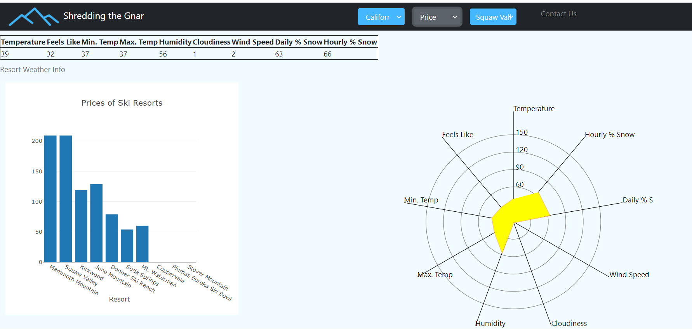
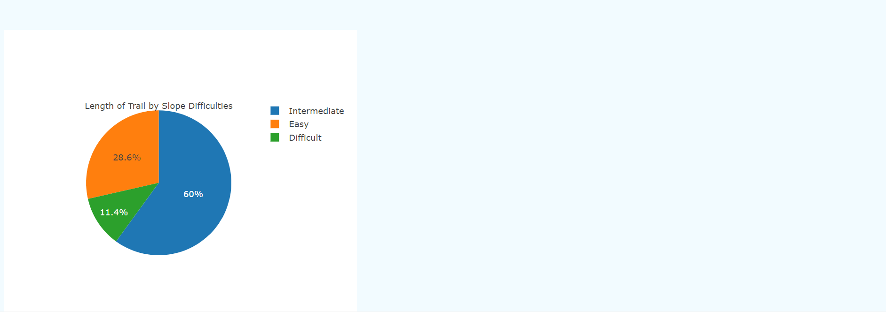

# **Find the resort that's right for you!**

**Shredding the Gnar** was motivated by a desire to identify and locate the multitude of ski and snowboard resorts around the US. Our team’s goal is to create a page to access information about each resort. Our target audience is people with all levels of ski/snowboard experience and a range of budgets. We seek to create a site that is easy to navigate, visually appealing, and informative to provide the user with a streamlined experience in finding their next ski/snowboard location.

## Before you start:
1. On your server/computer run PostrgeSQL and create new DB with name SkiResorts
2. Open Jupiter notebook DataSetUp.ipynb from projectSetUp folder.
3. In the same directory as DataSetUp.ipynb create file config.py and add your password for database as postgrepass='YOUR_PASSWORD_HERE'
4. Run all rows in DataSetUp.ipynb
5. Open query tool in PGadmin and run UpdateDB.sql
6. Run node index.js
7. Run app.py

## Our site:
The **index page** contains a map that can be filtered by price or by state.  

 
  
In addition, the "State" dropdown button will bring up the cheapest and most expensive resorts in selected state.

The **comparison page** gives the user the ability to select "State", "Price", or "Resort" from the dropdown menu to see a bar chart with the price distribution of each resort, either filtered by state or price range. Additionally, selecting a resort from the "Resort" dropdown produces a table with current weather conditions, a radar chart with a visualization of the weather table, and a pie chart with the distribution of slope difficulty by resort.

The **Contact Us** link will take the user to the presentation about how Team Shredding the Gnar put this site together.

See our presentation [here](https://docs.google.com/presentation/d/11My6oznZEgoI8yojyB5zZIndk0h40zuZ8xHygYNEmns/edit#slide=id.p).
Happy shredding!  
-- Team Shredding the Gnar

